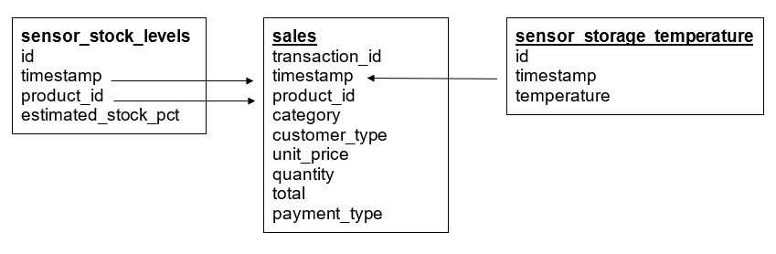
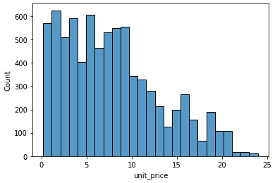
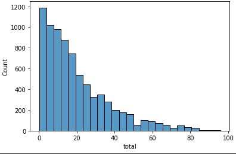
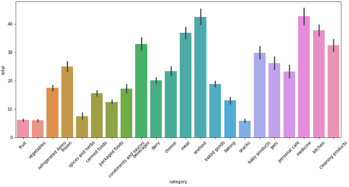

# Grocery Supply Chain Predictive Analytics

## Project Overview

### Business Problem

This project aims to help Gala Groceries, a fictional company, with a supply chain issue. Groceries are highly perishable items. If you overstock, you are wasting money on excessive storage and waste, but if you understock, you risk losing customers. They want to know how to better stock the items that they sell.

### Tasks Completed

- Exploratory data analysis using Python to understand and find insights in customer sales data. Merged three relational tables to prepare the data for modelling. See the [data](#data) and [figures](#figures) below.
- Created a machine learning pipeline where various algorithms were tested. Utilized hyperparameter tuning on the top three performing [models](#machine-learning-algorithm-scores).
  - SGD Linear Regression
  - Support Vector Machine
  - Soft Voting Regressor (SGD LR, SVM)
- Presented modelling results back to the client using PowerPoint.
- Utilized Linear Regression with SGD as the optimal model for production and scaling.

### Data

Features used for training and testing
- `quantity`
- `total`
- `temperature`
- `unit_price`
- `category`
- Features engineered
    - `month`
    - `day`
    - `day_of_week`
    - `hour`

### Machine Learning Algorithm Scores

| Models                                      | MAE   |
| ------------------------------------------- | ----- |
| SGD Linear Regression                       | 0.224 |
| Support Vector Machine                      | 0.226 |
| Random Forest                               | 0.237 |
| Soft Voting Regressor (SGD LR, SVM)         | 0.224 |
| Soft Voting Regressor (SGD LR, SVM, RF)     | 0.226 |
| SGD Linear Regression - Tuned               | 0.223 |
| Support Vector Machine - Tuned              | 0.223 |
| Soft Voting Regressor (SGD LR, SVM) - Tuned | 0.223 |

## Code and Packages Used

Python version: 3.10.2
Packages: os, pandas, numpy, matplotlib, seaborn, sklearn, datetime, datetime_truncate, joblib

## Figures

### Unit Price Distribution

### Sales Total Distribution

### Sales By Category

